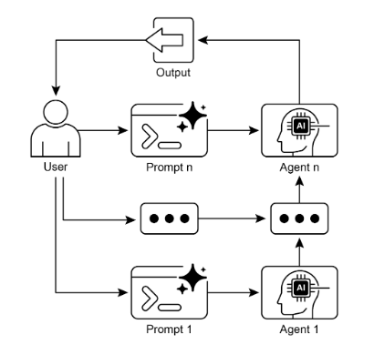

# Prompt Chaining Pattern

Prompt Chaining applies a divide-and-conquer strategy to LLM workflows. Instead of asking a model to solve a complex task in one step, you decompose the problem into a sequence of focused sub-tasks. Each step has a clear goal, input, and output; the output from one step becomes the input to the next.



This pattern improves reliability, interpretability, and control, and enables integration with tools, data sources, and structured schemas across steps.

## Why single prompts struggle

Monolithic prompts for multifaceted tasks often fail due to:
- Instruction neglect: parts of long prompts are overlooked.
- Contextual drift: the model loses the thread as it juggles too many goals.
- Error amplification: early mistakes compound downstream.
- Context-window limits: insufficient space for all constraints and data.
- Increased hallucination risk: cognitive load grows with complexity.

Example failure mode: “Analyze a market report, summarize it, identify trends with data points, and draft an email.” A single prompt may summarize well but fail at extracting precise data or producing the right email tone.

## How chaining fixes it

Chaining swaps one vague, overloaded prompt for a sequence of targeted steps. Each step:
- Has a single, narrow objective.
- Receives only the data it needs.
- Produces structured or tightly scoped output.

Benefits:
- Reliability: simpler targets per step reduce confusion.
- Debuggability: inspect and fix a single stage without rewriting everything.
- Control: enforce schemas and validations between steps.
- Extensibility: insert tool calls or retrieval at the exact step where needed.

## A canonical three-step pipeline

1) Summarize
- Prompt: “Summarize the key findings of the following market research report: [text].”
- Output: concise summary optimized for downstream use, not prose perfection.

2) Identify trends with evidence
- Prompt: “Using the summary, identify the top three emerging trends and extract the specific data points that support each trend: [summary].”
- Output: structured list of trends and citations.

3) Compose email
- Prompt: “Draft a concise email to the marketing team that outlines the following trends and their supporting data: [structured trends].”
- Output: final message tailored to tone, length, and audience.

By decoupling the objectives, each step can be role-specialized (e.g., “Market Analyst” → “Trade Analyst” → “Documentation Writer”) to further clarify expectations.

## Structured outputs: the backbone of reliable chains

When steps pass free-form text, ambiguity creeps in. Prefer JSON (or similar) with explicit fields so downstream prompts can reason deterministically.

Example JSON for the “trends” step:
```json
{
  "trends": [
    {
      "trend_name": "AI-Powered Personalization",
      "supporting_data": "73% of consumers prefer to do business with brands that use personal information to make their shopping experiences more relevant."
    },
    {
      "trend_name": "Sustainable and Ethical Brands",
      "supporting_data": "Sales of products with ESG-related claims grew 28% over the last five years, compared to 20% for products without."
    }
  ]
}
```

Design tips:
- Define a schema per step with required/optional fields.
- Include “provenance” fields (source text spans, URLs, IDs).
- Validate after each step; reject and reprompt on schema violations.
- Keep outputs minimal; don’t pass entire documents if a summary suffices.

## Hands-on Code Example

[](https://mybinder.org/v2/gh/peeush-agarwal/peeush-agarwal.github.io/main?urlpath=%2Fdoc%2Ftree%2Fnbs%2Fagentic-ai%2F01_prompt_chaining.ipynb){:target="_blank"}

## Context Engineering vs Prompt Engineering

Prompt engineering optimizes one-off phrasing. Context Engineering designs the full informational environment before generation:
- System instructions: persona, tone, constraints, safety.
- Retrieved documents: only the most relevant chunks.
- Tool outputs: API/database results injected just-in-time.
- Implicit context: user identity, history, environment state.

Key insight: even top-tier models underperform with weak context. Chaining plus strong context yields clarity at each step and keeps the model grounded in the right data at the right time.

## When to use this pattern

Use Prompt Chaining when:
- The task spans multiple distinct operations.
- You need structured data between steps.
- Tools must be invoked between reasoning phases.
- You’re building agentic systems that must plan, reason, and maintain state.
- The single-prompt approach shows drift, omissions, or hallucinations.

Rule of thumb: if a human would break it into steps, the model likely should too.

## Design checklist

- Goals: write one crisp objective per step; avoid mixed intents.
- Inputs: pass only what the step needs; trim aggressively.
- Outputs: specify schemas; include examples and validation.
- Roles: set a focused role/system message per step.
- Guardrails: add content, schema, and length constraints.
- Recovery: define retries, fallbacks, and escalation paths.
- Observability: log inputs/outputs, timings, and tool calls by step.
- State: persist intermediate artifacts so you can resume or audit.

## Failure modes and anti-patterns

- Over-chaining: too many steps add latency and overhead. Merge steps if they don’t add control or clarity.
- Unstructured handoffs: free text between steps invites drift. Use JSON.
- Context bloat: dumping full source docs at every step wastes tokens. Summarize and filter.
- Hidden coupling: downstream prompts assume fields that upstream prompts don’t guarantee. Stabilize with schemas and validators.
- Silent errors: no validation → bad data propagates. Always check outputs.
- Tool chaos: ad-hoc tool use without a plan. Decide which step calls which tool and why.

## Practical applications

- Information processing: ingest → chunk → summarize → extract → classify.
- Complex query answering: retrieve → synthesize → verify → cite.
- Data extraction and transformation: parse → normalize → map to domain schema.
- Content generation: outline → draft → fact-check → edit → finalize.
- Conversational agents with state: intent → plan → tool use → reflect → answer.
- Code workflows: spec → scaffold → implement → test → fix → document.
- Multimodal reasoning: detect → describe → reason → generate action.

## Tooling and orchestration

Frameworks help define graph-like flows, enforce schemas, and manage retries:
- LangChain/LangGraph: compose nodes, edges, and control flow for multi-step LLM graphs.
- Google ADK: define agent behaviors, tool integrations, and stateful workflows.

Common patterns:
- Deterministic stages: make some nodes pure transformations (no model).
- Branching: conditional paths based on validation or classification.
- Reflection: add a “critic” step to review and correct outputs.
- Tool steps: dedicated nodes to call APIs/DBs; inject results into context.

## Evaluation and reliability

Measure at the step and end-to-end levels:
- Step-level: schema compliance, accuracy on known fields, latency.
- Pipeline-level: task success rate, groundedness/citation quality, human preference.
- Safety: red-teaming for harmful or off-policy outputs per step.
- Cost/latency: token usage by step; optimize largest contributors first.

Operational guardrails:
- JSON schema validators; reject-then-reprompt on violations.
- Idempotent steps; deduplicate by content hash or IDs.
- Caching for expensive sub-steps (e.g., retrieval).
- Tracing with correlation IDs across the chain.

## Worked prompt templates

1) Summarizer (role-scoped)
- System: “You are a Market Analyst. Be concise, factual, and avoid speculation.”
- User: “Summarize key findings of the report. Output JSON {summary:string, key_points:string[]}.”
- Notes: cap lengths, forbid new claims.

2) Trend extractor
- System: “You are a Trade Analyst. Identify trends and evidence only from the summary.”
- User: “Given the summary, produce JSON {trends:[{trend_name, supporting_data}]}.”

3) Email composer
- System: “You are an Expert Documentation Writer. Tone: crisp, executive-ready.”
- User: “Draft an email using the trends JSON. Include subject and 2–3 short paragraphs. Avoid marketing fluff.”

## At a glance

What: Monolithic prompts overwhelm models on complex tasks.

Why: Chaining decomposes the work into simple, sequential steps, enabling structure, validation, tool integration, and better control.

Rule of thumb: If multiple distinct processing stages or external tools are involved, prefer a chain. This is foundational for multi-step agentic systems.

## Conclusion

Prompt Chaining is a practical, foundational pattern for building robust LLM systems. By decomposing complexity, enforcing structure, and engineering context at each step, you gain reliability, transparency, and leverage for tools and state. Mastering this pattern is key to creating agentic workflows that plan, reason, and execute beyond the limits of a single prompt.

[Back to Agentic AI Design Patterns](index.md) | [Back to Design Patterns](../index.md) | [Back to Home](../../index.md)
