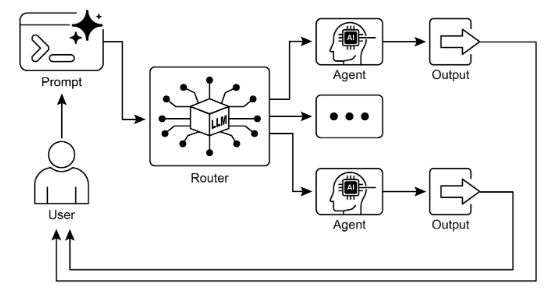

# Routing Pattern

## 1. Overview
Routing adds conditional decision-making to agent workflows. Instead of following a fixed, linear sequence (as in basic prompt chaining), a routed system evaluates incoming input and chooses among multiple possible next actions (specialized functions, tools, sub-agents, or escalation paths). This enables flexibility, contextual responsiveness, and adaptive behavior beyond deterministic execution.

## 2. Motivation
Sequential (purely linear) processing is limited when inputs vary in intent, complexity, or required capability. A single path can force generic handling, under-utilize specialized tools, and fail to respond appropriately to ambiguous or mixed requests. Routing overcomes these limitations by introducing a mechanism that: (a) analyzes input, (b) determines intent or category, and (c) directs control flow accordingly.

## 3. Core Idea
A routing mechanism evaluates an input (and potentially accumulated context) and outputs a directive—typically a category, label, or destination identifier—that specifies the next step. This transforms the system from a static executor into a dynamic arbiter capable of selecting the most appropriate process or resource.

## 4. Illustrative Example
A customer inquiry agent first classifies the user’s query, then:
- Sends direct factual questions to a question-answering component.
- Uses an account lookup tool for order information.
- Escalates complex or sensitive issues.
- Requests clarification if the user’s intent is unclear.

A more advanced routed agent might follow these steps:
1. Analyze the user’s query.
2. Determine intent.
3. Route accordingly:
   - "check order status" → order database interaction chain.
   - "product information" → product catalog search chain.
   - "technical support" → troubleshooting or escalation chain.
   - unclear intent → clarification sub-agent or prompt chain.

### Hands-on Code Example

{:target="_blank"}

## 5. Implementation Approaches
Routing can be implemented through different mechanisms. Each offers trade-offs in determinism, flexibility, and complexity.

### 5.1 LLM-Based Routing
- The language model is prompted to analyze input and output only a category label or instruction (e.g., Order Status, Product Info, Technical Support, Other).
- The system reads that output and branches the workflow.
- Useful for natural language interpretation without predefined rigid rules.

### 5.2 Embedding-Based Routing
- Convert the input query to a vector embedding.
- Compare it with embeddings representing available routes or capabilities.
- Select the most similar route (semantic proximity guides the decision).
- Effective when meaning (rather than keywords) should drive selection.

### 5.3 Rule-Based Routing
- Use predefined rules (if-else, switch, pattern matches, keyword checks, structured data triggers).
- More deterministic and faster than LLM-based approaches.
- Less flexible with nuanced, novel, or ambiguous inputs.

### 5.4 Machine Learning Model–Based Routing
- Train a discriminative classifier on labeled examples for the routing task.
- Distinct from LLM-based routing: decision is encoded in learned weights, not produced via a generative prompt at inference time.
- May optionally use LLMs during data preparation (e.g., synthetic data generation) but not during real-time routing.

## 6. Framework Support
- **LangChain / LangGraph**: Provide constructs for defining conditional logic and stateful transitions. LangGraph’s state-based graph architecture is well-suited for scenarios where decisions depend on accumulated system state.
- **Google’s Agent Development Kit (ADK)**: Supplies foundational components for structuring capabilities and interaction models that underpin routing logic.

## 7. Benefits
Routing enables systems to:
- Move beyond rigid linear execution.
- Respond dynamically to varied inputs.
- Utilize specialized tools or sub-agents efficiently.
- Escalate appropriately (e.g., to a human) when complexity warrants it.
- Support logical arbitration among multiple possible processing paths.

## 8. Practical Applications & Use Cases
Routing functions as a control mechanism across domains:
- **Human-Computer Interaction (e.g., virtual assistants, tutors)**: Interpret user intent, choose retrieval, escalation, or curriculum progression.
- **Automated Data / Document Processing Pipelines**: Classify incoming items (emails, tickets, API payloads) and direct them to the correct transformation or escalation workflow.
- **Multi-Agent / Tool Ecosystems**: Dispatch tasks to specialized agents (search, summarize, analyze) or coding assistant functions (debug, explain, translate) based on objective and context.

## 9. At a Glance
- **What**: A method for dynamically selecting the appropriate tool, sub-process, or workflow branch instead of following a static chain.
- **Why**: Real-world requests vary; conditional logic is required to handle diverse intents, contexts, and complexities effectively.
- **Rule of Thumb**: Use routing when multiple distinct workflows or sub-agents must be chosen based on user input or current state (e.g., triaging support categories, distinguishing task types).

## 10. Key Takeaways
- Enables conditional, dynamic decision-making about workflow progression.
- Supports adaptation to diverse and evolving inputs.
- Can be implemented via LLM prompts, embeddings, rules, or trained classifiers.
- Frameworks like LangGraph and Google ADK provide structured ways to express and manage routing logic.

## 11. Conclusion
Routing is central to building adaptive, responsive agentic systems. By incorporating a routing mechanism, systems can intelligently choose how to process inputs, when to escalate, and which specialized component to invoke. This adaptability is essential for handling the variability of real-world tasks. Different implementation approaches (LLM-based, embedding-based, rule-based, classifier-based) offer distinct advantages, and frameworks provide architectural support for organizing conditional logic. Mastery of the routing pattern enables the construction of versatile and context-aware agentic applications.

[Back to Agentic AI Design Patterns](index.md) | [Back to Design Patterns](../index.md) | [Back to Home](../../index.md)
