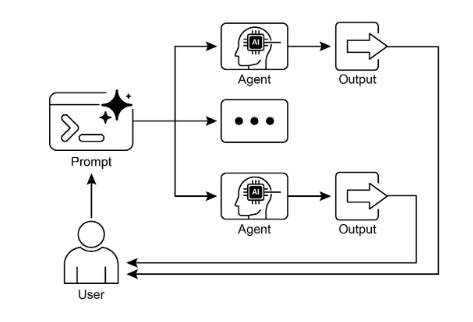

# Parallelization Pattern

## 1. Overview
The Parallelization Pattern addresses situations where multiple sub-tasks in an agentic workflow can be executed at the same time instead of one after another. It applies to independent components such as large language model (LLM) calls, tool invocations, external API queries, data lookups, computations, or even entire sub-agents. Executing independent tasks concurrently reduces overall elapsed time compared to a strictly sequential approach.

It complements two previously established patterns:
1. Prompt Chaining – deterministic, linear step progression.
2. Routing – conditional branching and dynamic path selection.
3. Parallelization – concurrent execution of independent branches to improve efficiency.

## 2. Motivation
Sequential workflows accumulate the latency of every step, even when some steps do not depend on the outputs of others. When several operations are independent, waiting for each to finish before starting the next is inefficient. Parallel execution removes unnecessary idle periods by launching all independent activities simultaneously and then proceeding only after all required results are available. This is especially impactful when interacting with external services (APIs, databases, remote tools) that introduce network or system latency.

## 3. Core Principle
Identify the parts of a workflow that:
1. Do not rely on the outputs of other parts.
2. Must all complete before a later synthesis or aggregation step.
3. Can safely be launched concurrently.

Then run those parts in parallel, followed by any sequential consolidation that depends on their combined outputs.

## 4. Illustrative Research Example
Sequential version:
1. Search for Source A.
2. Summarize Source A.
3. Search for Source B.
4. Summarize Source B.
5. Synthesize a final answer from the two summaries.

Parallel version:
1. Search for Source A and Search for Source B at the same time.
2. After both searches finish, Summarize Source A and Summarize Source B simultaneously.
3. Synthesize the final answer (this final phase waits for the prior parallel steps to complete).

This transformation shortens total duration by overlapping independent operations.

### Hands-on Code Example

{:target="_blank"}

## 5. Identifying Parallelizable Segments
Look for groups of tasks where each member:
- Has input requirements already satisfied at the start of the group.
- Shares no immediate dependency on the output of other tasks in the group.
- Produces outputs required together at a later combining step.

Any task that fails one of these conditions remains sequential relative to those it depends on or that depend on it.

## 6. Framework Support
Several frameworks provide constructs enabling this pattern:
- LangChain (including LangChain Expression Language) allows combining runnable objects in ways that support concurrent branches in addition to sequential composition via operators (such as the sequential operator symbol). Parallel branches can be constructed where appropriate.
- LangGraph represents workflows as a graph where a single state transition can enable multiple nodes to become active, permitting concurrent execution of those nodes.
- Google Agent Development Kit (ADK) offers native support for parallel agent execution within multi-agent systems, allowing multiple agents to operate at the same time instead of serially.

## 7. Efficiency Gains
Parallelization reduces wall‑clock time for workflows containing multiple independent lookups, computations, or model calls. It increases responsiveness when constructing aggregated outputs and optimizes the use of waiting periods inherent in external I/O operations.

## 8. Practical Applications & Use Cases
1. Information Gathering and Research
	- Parallel Tasks: Search news articles, pull stock data, check social media mentions, query a company database simultaneously.
	- Benefit: Assembles a comprehensive view faster than sequential lookups.

2. Data Processing and Analysis
	- Parallel Tasks: Sentiment analysis, keyword extraction, categorization, urgent issue identification run across a batch concurrently.
	- Benefit: Produces multi-faceted analysis quickly.

3. Multi-API or Tool Interaction
	- Parallel Tasks: Flight price checks, hotel availability, local events lookup, restaurant recommendations gathered concurrently.
	- Benefit: Delivers a complete plan sooner.

4. Content Generation with Multiple Components
	- Parallel Tasks: Generate subject line, draft body, find image, create call-to-action text at the same time.
	- Benefit: Faster assembly of final content.

5. Validation and Verification
	- Parallel Tasks: Email format check, phone validation, address verification, profanity screening executed together.
	- Benefit: Rapid overall feedback.

6. Multi-Modal Processing
	- Parallel Tasks: Text sentiment and keyword analysis concurrently with image object and scene description.
	- Benefit: Faster integration of modality-specific insights.

7. A/B Testing or Multiple Options Generation
	- Parallel Tasks: Generate multiple creative variations (e.g., several headlines) simultaneously using differing prompts or models.
	- Benefit: Swift comparison and selection of preferred option.

## 9. At a Glance
**What:** Many workflows require multiple sub-tasks to reach a final objective. Performing each one strictly after the previous creates cumulative latency, especially problematic for external I/O (APIs, database queries). Without concurrency, total time is the sum of individual durations.

**Why:** Simultaneous execution of independent tasks shortens overall runtime. Framework constructs allow invoking independent sub-tasks in parallel and waiting until all conclude before continuing.

**Rule of Thumb:** Apply when a workflow contains multiple independent operations such as fetching from several APIs, processing separate data chunks, or generating multiple content components for later synthesis.

## 10. Key Takeaways
- Executes independent tasks concurrently to improve efficiency.
- Particularly valuable when tasks involve waiting on external resources like APIs.
- Introduces additional complexity and cost in design, debugging, and system logging.
- Supported by frameworks that offer built-in parallel execution definitions.
- LangChain Expression Language includes a construct (RunnableParallel) for side-by-side execution.
- Google ADK can leverage an approach where a coordinator agent’s LLM identifies independent sub-tasks and triggers their concurrent handling by specialized sub-agents.
- Reduces overall latency and increases responsiveness for complex tasks.

## 11. Benefits and Trade-Offs
**Benefits:** Lower total latency; better utilization of idle waiting periods; faster delivery of composite outputs.

**Trade-Offs:** Added architectural complexity; more intricate debugging; increased logging needs to trace concurrent branches.

## 12. Integration With Other Patterns
Parallelization can coexist with sequential chaining (parallel phases bracketed by ordered phases) and routing (conditional logic determining whether parallel branches are launched). Combining these control structures enables sophisticated multi-phase agent workflows.

## 13. Conclusion
The Parallelization Pattern optimizes computational workflows by concurrently executing independent sub-tasks instead of serializing them. This lowers latency in scenarios with multiple model inferences or external service calls. Framework mechanisms provide explicit constructs for defining and managing parallel execution: runnable combinations, branching graphs, and coordinated multi-agent delegation. When blended with sequential control (chaining) and conditional branching (routing), parallelization supports the construction of high-performance agentic systems capable of efficiently handling diverse and complex objectives.

[Back to Agentic AI Design Patterns](index.md) | [Back to Design Patterns](../index.md) | [Back to Home](../../index.md)
