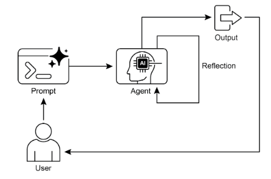
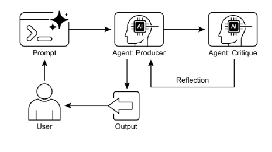

# Reflection Pattern

## 1. Overview
The Reflection Pattern introduces a deliberate feedback loop into an agentic workflow so that an output is not accepted as final without inspection and improvement. Earlier foundational patterns—Chaining (sequential execution), Routing (dynamic path choice), and Parallelization (concurrent execution)—optimize flow and structure, yet they do not by themselves ensure that an initial result is optimal, accurate, complete, or well‑aligned with complex requirements. Reflection addresses this gap by enabling an agent (or coordinated agents) to examine a produced result or internal state, critique it against explicit criteria, and refine it through one or more iterative cycles.

### Self-Reflection

### Producer-Critique Model

## 2. Core Concept
Reflection is an intentional process of self‑evaluation and refinement. Instead of a one‑pass generate‑and‑return approach, the system executes a generate–evaluate–refine loop. This can be done by a single agent (self‑reflection) or by separating roles so that one entity produces and another critiques. The goal is progressive quality improvement, heightened accuracy, and better adherence to instructions or goals.

## 3. Canonical Workflow
1. **Execution**: Produce an initial output (content, code, plan, summary, solution step, etc.).
2. **Evaluation / Critique**: Analyze that output for dimensions such as accuracy, coherence, completeness, style, feasibility, adherence to instructions, or other specified criteria. This may be another model call, a ruleset, or a specialized evaluator.
3. **Reflection / Refinement**: Determine concrete improvements; revise the output or adjust future strategy, parameters, or planning steps.
4. **Iteration (Optional but Common)**: Repeat the cycle until a stopping condition is met (quality threshold, iteration cap, resource limit, or goal satisfaction).

## 4. Producer–Critic (Generator–Reviewer) Model
A powerful implementation separates responsibilities into two logical roles:
- **Producer Agent**: Focused solely on generating the initial answer, draft, code, plan, or intermediate artifact.
- **Critic Agent**: Dedicated to evaluating the Producer’s result using a distinct instruction set or persona (e.g., fact checker, senior engineer, stylistic reviewer). It surfaces flaws, omissions, inconsistencies, and opportunities for improvement.

### Why Separation Helps
- Reduces bias that can occur when the same process judges its own work without a fresh viewpoint.
- Allows specialized evaluation criteria and persona‑driven scrutiny.
- Produces structured, objective feedback guiding a more targeted refinement.

### Feedback Loop Dynamics
Producer output → Critic review → Structured feedback → Producer revision → (optional repeat). This cycle embeds a quality gate between draft and acceptance.

## 5. Relation to Other Structural Patterns
- **Versus Chaining**: Chaining passes outputs forward without mandated quality review. Reflection injects evaluative control points.
- **Versus Routing**: Routing chooses paths; Reflection scrutinizes content already produced.
- **Versus Parallelization**: Parallel branches increase throughput or coverage; Reflection deepens quality of a given branch’s result through deliberate refinement.

## 6. Implementation Characteristics
- Can be implemented with a single evaluation/refinement step (minimal form) or multiple iterations (full loop).
- Iterative setups benefit from state management and conditional transitions based on critique outcomes.
- Frameworks that support structured state and branching (e.g., those enabling graph‑like workflows) help orchestrate multi‑cycle refinement.
- A single reflection pass can still meaningfully elevate quality when full iteration is impractical.

## 7. Interaction with Goal Setting and Monitoring
Reflection gains leverage when paired with explicit goals and monitoring. Goals provide benchmarks for assessing adequacy; monitoring supplies ongoing performance or progress signals. Reflection then functions as the corrective engine, analyzing deviations and adjusting plan or output toward the goal. This collaboration turns a passive executor into a purposeful, adaptive system.

## 8. Role of Memory
Conversation or interaction memory enhances reflection by:
- Supplying historical context for more informed critique.
- Preventing recurrence of prior mistakes by remembering past feedback.
- Enabling cumulative refinement where each cycle builds on earlier adjustments.
Without memory, each reflective cycle is isolated. With memory, refinement compounds over time.

## 9. Practical Applications & Use Cases
Reflection is especially valuable when correctness, completeness, nuance, or polish outweigh raw speed:

1. **Creative Writing & Content Generation**
   - Draft → critique for flow, tone, clarity → rewrite → optionally repeat.
   - Benefit: Produces more polished, effective, and coherent material.
2. **Code Generation & Debugging**
   - Generate code → run tests / static analysis → identify errors or inefficiencies → revise.
   - Benefit: Yields more robust and functional implementations.
3. **Complex Problem Solving**
   - Propose reasoning step → evaluate progress or contradictions → adjust or backtrack.
   - Benefit: Improves navigation of multi‑step reasoning spaces.
4. **Summarization & Information Synthesis**
   - Initial summary → compare to source key points → refine for completeness and accuracy.
   - Benefit: Produces concise yet comprehensive summaries.
5. **Planning & Strategy**
   - Initial plan → evaluate feasibility, constraints, risks → revise structure or ordering.
   - Benefit: Generates more realistic and effective action sequences.
6. **Conversational Agents**
   - Review previous turns and latest response for coherence and correctness → adjust next reply.
   - Benefit: Delivers more natural, context‑aware dialogue.

## 10. Cost–Benefit Considerations
**Advantages**:
- Iterative self‑correction boosts quality, accuracy, adherence to intricate instructions.
- Separation of production and critique enhances objectivity.
- Structured evaluation fosters targeted improvements instead of ad‑hoc revisions.

**Trade‑Offs**:
- Added latency (extra evaluation/refinement cycles).
- Increased computational and token cost.
- Potential to exceed context limits or hit external service throttling with many iterations.

## 11. Minimal vs. Iterative Reflection
- **Single Cycle**: Execute once, critique once, refine once—simple, lower cost, demonstrates core principle.
- **Multi‑Cycle**: Loop until criteria satisfied or limits reached—maximizes potential quality but multiplies overhead.

## 12. Workflow Control Elements
Key levers within a reflective loop:
- Criteria (accuracy, completeness, style, feasibility, instruction adherence).
- Stopping conditions (quality threshold, max iterations, resource caps).
- Feedback format (structured lists, categorized issues, prioritized suggestions).
- Role specialization (Producer vs. Critic) to reduce bias and heighten clarity.

## 13. Integration Notes
- A single reflective step can be embedded in linear chains for immediate uplift.
- Iterative reflection benefits from graph/state management constructs to branch (e.g., accept vs. rework) based on critique outcomes.
- Sequential workflows can chain Producer → Critic → Refiner stages explicitly.

## 14. At a Glance
- **What**: Introduces evaluation and refinement so initial outputs are not final; may employ a separate critic to enforce quality.
- **Why**: Creates a feedback loop that raises accuracy, coherence, completeness, and reliability.
- **Rule of Thumb**: Apply when quality and precision outweigh speed and cost; use a separate critic for objectivity or specialized evaluation.

## 15. Key Takeaways
- Feedback loop of execution, critique, and refinement elevates output quality.
- Producer–Critic separation strengthens objectivity and specialization.
- Gains come with increased latency, cost, and potential context pressure.
- Even a single reflection pass can meaningfully improve results.
- Enables self‑correction and progressive enhancement of performance.

## 16. Hands-On Example

{:target="_blank"}

## 17. Conclusion
The Reflection Pattern injects meta‑cognition into agent workflows by establishing a loop where outputs are scrutinized before acceptance. Through self‑reflection or a Producer–Critic arrangement, the system evaluates results against defined criteria and refines them, optionally across multiple iterations. Paired with goals, monitoring, and memory, reflection transforms procedural execution into adaptive problem solving, enabling higher quality, reliability, and adherence to complex requirements.

[Back to Agentic AI Design Patterns](index.md) | [Back to Design Patterns](../index.md) | [Back to Home](../../index.md)
