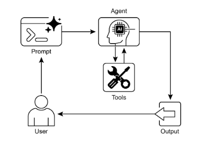
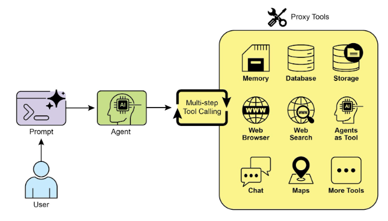

# Tool Use Pattern (Function / Tool Calling)

## 1. Overview
The Tool Use pattern extends earlier agentic patterns (Chaining, Routing, Parallelization, Reflection) by enabling interaction with external systems. It supplies the bridge between a language model’s internal reasoning and the outside world—APIs, databases, services, code execution environments, devices, or even other specialized agents. Through well-described tools, an agent can decide when to invoke external capabilities and incorporate the returned results into its ongoing reasoning or final response.

## 2. Core Motivation
Large language models are powerful text generators but are inherently constrained:
- Knowledge is static, limited to training data.  
- They cannot natively fetch real‑time or user‑specific information.  
- They cannot on their own perform external actions, precise computations, or state-changing operations.  

The Tool Use pattern overcomes these constraints by letting the model request execution of external functions ("tools") in a structured manner and then grounding subsequent reasoning in the returned results.

## 3. Process Flow
A typical end‑to‑end cycle proceeds through these stages:
1. **Tool Definition**: Each external capability is described with a name, purpose, parameters (with types and descriptions).  
2. **LLM Decision**: The model receives the user request plus available tool specifications and determines whether tool invocation is needed.  
3. **Function (Tool) Call Generation**: If needed, the model produces a structured output (commonly JSON) containing the tool name and argument values derived from the user input or current context.  
4. **Tool Execution**: The orchestration layer parses that structured output and invokes the corresponding external function with the supplied arguments.  
5. **Observation / Result**: The raw result from the external execution is captured.  
6. **LLM Processing (Optional but Common)**: The result is fed back to the model so it can integrate the new information—formulating a final answer, refining intermediate reasoning, invoking additional tools, or terminating the interaction.  

This loop can repeat if multiple tools are needed serially.

## 4. Tool Calling vs. Function Calling
While "function calling" captures the mechanics of structured invocation of predefined code functions, the broader framing of "tool calling" emphasizes that a tool may be:
- A local function.  
- A remote API endpoint.  
- A database query operation.  
- A command to another specialized agent.  

Viewing them as tools highlights the agent’s role as an orchestrator across a heterogeneous ecosystem of capabilities and intelligent entities.

## 5. Role in Agentic Architecture
Tool Use is a foundational pattern that elevates a model from passive text generation to active engagement—sensing (retrieving data), reasoning (deciding on next steps), and acting (triggering external effects). It unlocks:
- Up‑to‑date information access.  
- Interaction with private / proprietary datasets.  
- Execution of deterministic or computationally precise operations.  
- Real‑world or system-level actions.  

## 6. Practical Applications & Use Cases
The pattern appears wherever dynamic data retrieval or action-taking is required. Representative categories:

### 6.1 Information Retrieval from External Sources
- **Need**: Real‑time or non‑training data.  
- **Example Flow**: User asks for weather in a location → model selects weather tool with extracted location → tool returns structured weather data → model formats user-friendly reply.  

### 6.2 Interacting with Databases and APIs
- **Need**: Structured queries, state checks, transactional operations.  
- **Example Flow**: User asks if a product is in stock → model calls inventory API → stock count returned → model reports availability.  

### 6.3 Performing Calculations and Data Analysis
- **Need**: Accurate numeric computation or multi-step financial reasoning.  
- **Example Flow**: User asks for current price of a stock and profit on hypothetical shares → model calls stock data API → then calls calculator tool → aggregates result for response.  

### 6.4 Sending Communications
- **Need**: Outbound messaging or notifications.  
- **Example Flow**: User instructs sending an email → model extracts recipient, subject, body → email tool invoked → confirmation structured into reply.  

### 6.5 Executing Code
- **Need**: Running snippets for inspection or transformation.  
- **Example Flow**: User provides code asking what it does → model uses interpreter tool → execution output returned → model explains behavior.  

### 6.6 Controlling Other Systems or Devices
- **Need**: IoT or system orchestration.  
- **Example Flow**: User requests turning off lights → model calls smart home control tool with target device → acknowledgment returned → model reports success.  

Across all categories, the pattern transforms model output from speculative description to grounded action-backed response.

## 7. Step-by-Step Logic Emphasis
A distilled logical loop:
- Present available tool specifications.  
- Interpret user intent.  
- Decide on zero or more tool calls.  
- Emit structured call specification.  
- Execute externally.  
- Feed result back.  
- Integrate into final or next-step reasoning.  

## 8. At a Glance
**What**: A structured mechanism enabling a model to transcend static training knowledge by invoking external capabilities for information retrieval, computation, or action.  
**Why**: Provides a pathway to incorporate real‑time, proprietary, or action-derived results into responses.  
**Rule of Thumb**: Employ when tasks require breaking out of internal knowledge—real-time data, private datasets, precise calculations, code execution, or triggering operations in other systems.  

## 9. Key Takeaways
- Enables interaction with external systems and dynamic information.  
- Relies on clear tool descriptions (purpose, parameters, types).  
- The model autonomously decides if and when to invoke tools.  
- Results from tools are reintegrated into ongoing reasoning.  
- Essential for real‑world actionability and up‑to‑date responses.  
- LangChain provides decorators (e.g., `@tool`) plus constructs such as `create_tool_calling_agent` and `AgentExecutor` for integrating tool use.  
- Google ADK includes pre-built tools (e.g., Google Search, Code Execution, Vertex AI Search Tool).  

## 10. Framework Canvas Perspective
Frameworks (LangChain, LangGraph, Google Agent Developer Kit) allow registering tools and configuring agents to become tool-aware. On this "canvas" you:  
- Specify tool functions with metadata.  
- Supply them to the agent’s reasoning loop.  
- Let the orchestration layer parse and execute emitted structured calls.  

## 11. Broader Ecosystem View
Conceptualizing the model as an orchestrator clarifies that tools may include other agents. A primary agent can delegate to a specialized analytical or retrieval agent, broadening capability composition without changing the core calling pattern.

## 12. Hands-On Code Example

{:target="_blank"}

## 13. Comprehensive Concept Coverage Checklist
The material above covers:  
- Comparison with earlier patterns.  
- Motivation and limitations overcome.  
- Detailed multi-step process.  
- Distinction between function calling and broader tool calling.  
- Role in agentic architecture.  
- Six major use case categories with flows.  
- Logical loop summary.  
- At a glance (What, Why, Rule of Thumb).  
- Key takeaways including framework mentions and specific utilities.  
- Framework canvas perspective.  
- Ecosystem orchestration viewpoint.  
- Placeholder acknowledgment.  

## 14. Conclusion
The pattern is a critical architectural principle expanding a model’s functional scope beyond intrinsic text generation. By generating structured requests for external tools when needed, an agent can execute computations, retrieve information, and perform actions in other systems. Tool specifications are exposed to the model; its tool-use requests are then parsed and executed by an orchestration layer. Frameworks such as LangChain, Google ADK, and Crew AI streamline definition, exposure, and execution of these tools—simplifying the assembly of sophisticated agentic systems capable of meaningful interaction within broader digital environments.
