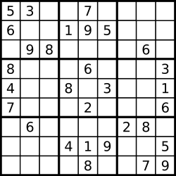

# Valid Sudoku

## Problem Statement

Given a 9 x 9 Sudoku board, determine if it is valid. Only the filled cells need to be validated according to the following rules:

- Each row must contain the digits 1-9 without repetition.
- Each column must contain the digits 1-9 without repetition.
- Each of the nine 3 x 3 sub-boxes of the grid must contain the digits 1-9 without repetition.

**Notes:**
- The board may be partially filled; it could be valid but not necessarily solvable.
- Only the filled cells need to be checked for validity.

**Example 1:**



**Input:**
```python
board = [
    ["5","3",".",".","7",".",".",".","."],
    ["6",".",".","1","9","5",".",".","."],
    [".","9","8",".",".",".",".","6","."],
    ["8",".",".",".","6",".",".",".","3"],
    ["4",".",".","8",".","3",".",".","1"],
    ["7",".",".",".","2",".",".",".","6"],
    [".","6",".",".",".",".","2","8","."],
    [".",".",".","4","1","9",".",".","5"],
    [".",".",".",".","8",".",".","7","9"]
]
```
**Output:** `true`

**Example 2:**

**Input:**
```python
board = [
    ["8","3",".",".","7",".",".",".","."],
    ["6",".",".","1","9","5",".",".","."],
    [".","9","8",".",".",".",".","6","."],
    ["8",".",".",".","6",".",".",".","3"],
    ["4",".",".","8",".","3",".",".","1"],
    ["7",".",".",".","2",".",".",".","6"],
    [".","6",".",".",".",".","2","8","."],
    [".",".",".","4","1","9",".",".","5"],
    [".",".",".",".","8",".",".","7","9"]
]
```
**Output:** `false`

**Explanation:** In Example 2, there are two '8's in the top left 3x3 sub-box, making the board invalid.

**Constraints:**
- `board.length == 9`
- `board[i].length == 9`
- `board[i][j]` is a digit `'1'`-`'9'` or `'.'`

## Code Template

```python
class Solution:
    def isValidSudoku(self, board: List[List[str]]) -> bool:
        # Your code here
        pass
```

## Solutions

- [Solution 1](./solution_01.md): This approach uses three sets of arrays to track the presence of numbers in rows, columns, and 3x3 sub-boxes. The time complexity is $$O(1)$$ (since the board size is fixed at 9x9), but generally $$O(N^2)$$ for an NxN board. The space complexity is $$O(1)$$ (only a few arrays of size 9 are used), but generally $$O(N)$$ for an NxN board.

[Back to Problem List](../index.md) | [Back to Categories](../../index.md)
