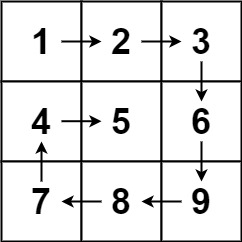

# Spiral Matrix

## Problem Statement

Given an `m x n` matrix, return all elements of the matrix in spiral order.

### Examples

**Example 1:**



**Input:**  
`matrix = [[1,2,3],[4,5,6],[7,8,9]]`  
**Output:**  
`[1,2,3,6,9,8,7,4,5]`

**Example 2:**


**Input:**  
`matrix = [[1,2,3,4],[5,6,7,8],[9,10,11,12]]`  
**Output:**  
`[1,2,3,4,8,12,11,10,9,5,6,7]`

### Constraints

- `m == matrix.length`
- `n == matrix[i].length`
- `1 <= m, n <= 10`
- `-100 <= matrix[i][j] <= 100`

## Code Template

```python
class Solution:
    def spiralOrder(self, matrix: List[List[int]]) -> List[int]:
        # Your code here
        pass
```

## Solutions

- [Solution 1](./solution_01.md): This approach uses four pointers to track the boundaries of the matrix and iteratively collects elements in a spiral order. The time complexity is O(m*n) and space complexity is O(1) for the output list.

[Back to Problem List](../index.md) | [Back to Categories](../../index.md)
