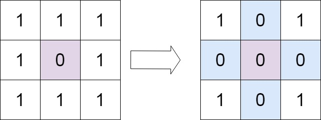

# Set Matrix Zeroes
## Problem Statement

Given an `m x n` integer matrix, your task is to set the entire row and column to zero if any element in the matrix is zero. The operation must be performed **in place**.

### Examples

**Example 1:**



- Input: `matrix = [[1,1,1],[1,0,1],[1,1,1]]`
- Output: `[[1,0,1],[0,0,0],[1,0,1]]`

**Example 2:**


- Input: `matrix = [[0,1,2,0],[3,4,5,2],[1,3,1,5]]`
- Output: `[[0,0,0,0],[0,4,5,0],[0,3,1,0]]`

### Constraints

- `m == matrix.length`
- `n == matrix[0].length`
- `1 <= m, n <= 200`
- `-2^{31} <= matrix[i][j] <= 2^{31} - 1`

### Follow Up

- A straightforward solution uses O(mn) space, which is not optimal.
- An improved solution uses O(m + n) space, but can you do better?
- Devise a solution that uses **constant space**.

## Code Template

```python
class Solution:
    def setZeroes(self, matrix: List[List[int]]) -> None:
        # Your code here
        pass
```

## Solutions

- [Solution 1](./solution_01.md): This approach uses the first row and first column of the matrix as markers to indicate which rows and columns should be set to zero. It also uses a separate flag to track if the first column should be zeroed. The time complexity is O(mn) and space complexity is O(1).

[Back to Problem List](../index.md) | [Back to Categories](../../index.md)
