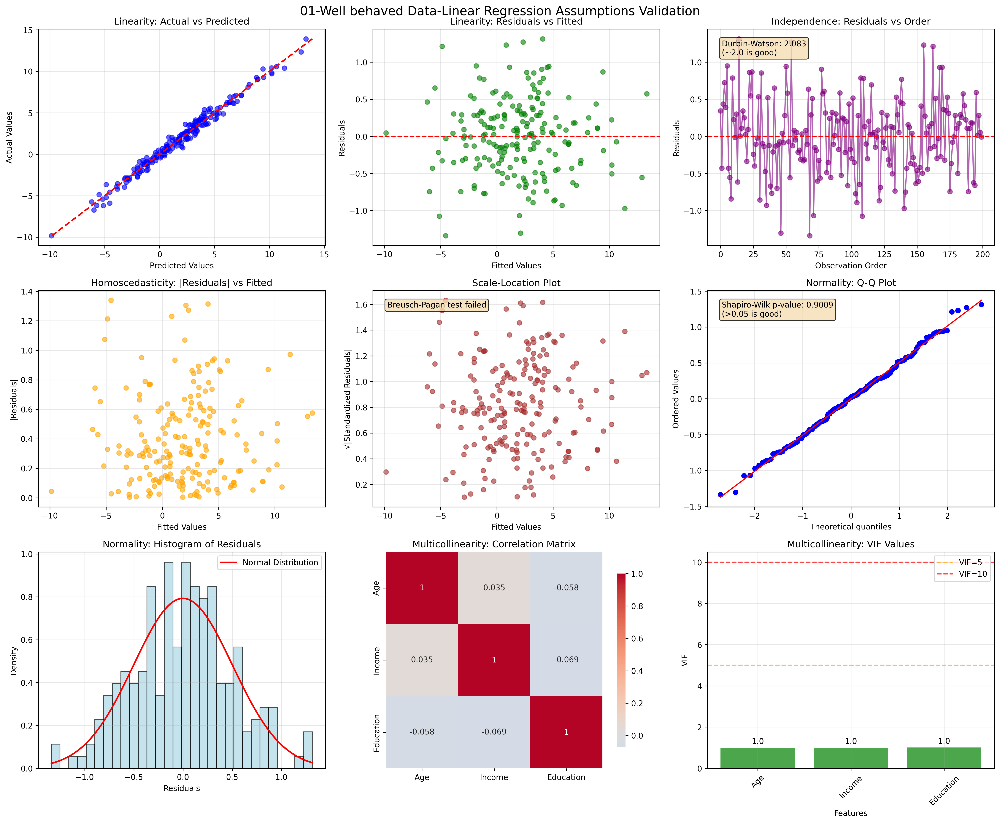
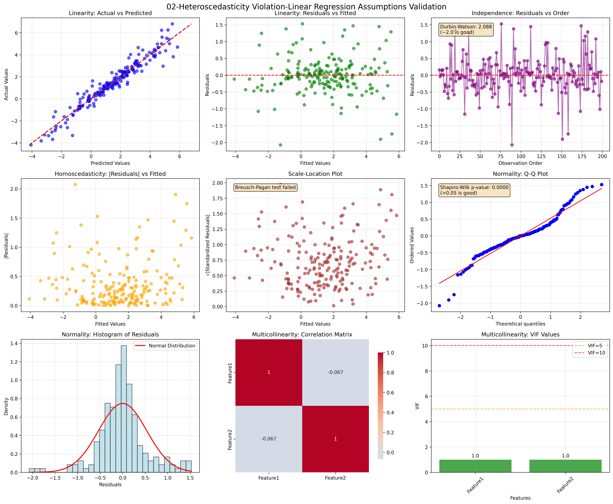
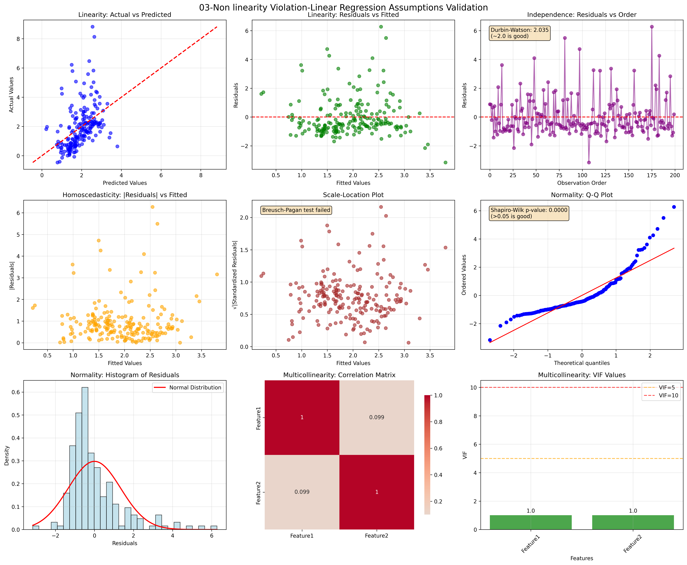

# Linear Regression: A Comprehensive Guide

## Table of Contents
1. [Introduction](#introduction)
2. [Mathematical Foundation](#mathematical-foundation)
3. [Types of Linear Regression](#types-of-linear-regression)
4. [Algorithm Implementation](#algorithm-implementation)
5. [Assumptions](#assumptions)
6. [Evaluation Metrics](#evaluation-metrics)
7. [Advantages and Disadvantages](#advantages-and-disadvantages)
8. [Common Interview Questions](#common-interview-questions)
9. [Practical Considerations](#practical-considerations)
10. [Code Examples](#code-examples)

## Introduction

Linear Regression is one of the most fundamental and widely-used algorithms in machine learning and statistics. It models the relationship between a dependent variable (target) and one or more independent variables (features) using a linear equation. Despite its simplicity, it serves as the foundation for understanding more complex algorithms and remains highly effective for many real-world problems.

**Key Concepts:**
- **Supervised Learning**: Uses labeled training data
- **Regression Task**: Predicts continuous numerical values
- **Parametric Model**: Assumes a specific functional form
- **Linear Relationship**: Models linear relationships between variables

## Mathematical Foundation

### Simple Linear Regression

For a single feature, the linear regression model is:

$$y = \beta_0 + \beta_1 x + \epsilon$$

Where:
- $y$ = dependent variable (target)
- $x$ = independent variable (feature)
- $\beta_0$ = y-intercept (bias term)
- $\beta_1$ = slope (weight/coefficient)
- $\epsilon$ = error term (noise)

### Multiple Linear Regression

For multiple features, the model extends to:

$$y = \beta_0 + \beta_1 x_1 + \beta_2 x_2 + ... + \beta_n x_n + \epsilon$$

In matrix form:

$$\mathbf{y} = \mathbf{X}\boldsymbol{\beta} + \boldsymbol{\epsilon}$$

Where:
- $\mathbf{y}$ = vector of target values $(n \times 1)$
- $\mathbf{X}$ = design matrix of features $(n \times (p+1))$
- $\boldsymbol{\beta}$ = vector of coefficients $((p+1) \times 1)$
- $\boldsymbol{\epsilon}$ = error vector $(n \times 1)$
- $p$ = number of features

### Cost Function

The goal is to minimize the **Mean Squared Error (MSE)**:

$$J(\boldsymbol{\beta}) = \frac{1}{2m} \sum_{i=1}^{m} (h_{\boldsymbol{\beta}}(x^{(i)}) - y^{(i)})^2$$

Where:
- $m$ = number of training examples
- $h_{\boldsymbol{\beta}}(x^{(i)}) = \boldsymbol{\beta}^T x^{(i)}$ = hypothesis function

In matrix form:

$$J(\boldsymbol{\beta}) = \frac{1}{2m} (\mathbf{X}\boldsymbol{\beta} - \mathbf{y})^T (\mathbf{X}\boldsymbol{\beta} - \mathbf{y})$$

### Analytical Solution (Normal Equation)

The optimal parameters can be found analytically:

$$\boldsymbol{\beta} = (\mathbf{X}^T\mathbf{X})^{-1}\mathbf{X}^T\mathbf{y}$$

**Conditions for existence:**
- $\mathbf{X}^T\mathbf{X}$ must be invertible (non-singular)
- Number of features $<$ number of samples
- Features must be linearly independent

## Types of Linear Regression

### 1. Ordinary Least Squares (OLS)
- Standard linear regression
- Minimizes sum of squared residuals
- No regularization

### 2. Ridge Regression (L2 Regularization)
Cost function with L2 penalty:

$$J(\boldsymbol{\beta}) = \frac{1}{2m} \sum_{i=1}^{m} (h_{\boldsymbol{\beta}}(x^{(i)}) - y^{(i)})^2 + \lambda \sum_{j=1}^{n} \beta_j^2$$

Where $\lambda$ is the regularization parameter.

### 3. Lasso Regression (L1 Regularization)
Cost function with L1 penalty:

$$J(\boldsymbol{\beta}) = \frac{1}{2m} \sum_{i=1}^{m} (h_{\boldsymbol{\beta}}(x^{(i)}) - y^{(i)})^2 + \lambda \sum_{j=1}^{n} |\beta_j|$$

### 4. Elastic Net
Combines L1 and L2 regularization:

$$J(\boldsymbol{\beta}) = \frac{1}{2m} \sum_{i=1}^{m} (h_{\boldsymbol{\beta}}(x^{(i)}) - y^{(i)})^2 + \lambda_1 \sum_{j=1}^{n} |\beta_j| + \lambda_2 \sum_{j=1}^{n} \beta_j^2$$

## Algorithm Implementation

### Gradient Descent Algorithm

```pseudocode
ALGORITHM: Linear Regression with Gradient Descent

INPUT: 
  - Training data: X (m × n), y (m × 1)
  - Learning rate: α
  - Number of iterations: max_iter
  - Convergence threshold: ε

OUTPUT: Optimal parameters β

PROCEDURE:
1. Initialize β randomly or to zeros
2. Add bias column to X (column of ones)
3. FOR iteration = 1 to max_iter:
   a. Compute predictions: ŷ = X × β
   b. Compute cost: J = (1/2m) × ||ŷ - y||²
   c. Compute gradients: ∇J = (1/m) × X^T × (ŷ - y)
   d. Update parameters: β = β - α × ∇J
   e. IF ||∇J|| < ε: BREAK (convergence)
4. RETURN β

COMPLEXITY:
- Time: O(max_iter × m × n)
- Space: O(m × n)
```

### Normal Equation Algorithm

```pseudocode
ALGORITHM: Linear Regression with Normal Equation

INPUT: 
  - Training data: X (m × n), y (m × 1)

OUTPUT: Optimal parameters β

PROCEDURE:
1. Add bias column to X (column of ones)
2. Compute X^T × X
3. Check if X^T × X is invertible
4. IF invertible:
   a. Compute β = (X^T × X)^(-1) × X^T × y
5. ELSE:
   a. Use pseudo-inverse or regularization
6. RETURN β

COMPLEXITY:
- Time: O(n³) for matrix inversion
- Space: O(n²)
```

## Assumptions

Linear regression relies on several critical assumptions that must be satisfied for the model to produce reliable and valid results. Violating these assumptions can lead to biased estimates, incorrect confidence intervals, and poor predictive performance.

### 1. Linearity

**Definition**: The relationship between the independent variables (features) and the dependent variable (target) is linear. This means the change in the target variable is proportional to the change in the feature variables.

**Mathematical Expression**: 
$$E[Y|X] = \beta_0 + \beta_1 X_1 + \beta_2 X_2 + ... + \beta_p X_p$$

**Detailed Explanation**:
- The conditional expectation of Y given X follows a linear function
- The coefficients represent the expected change in Y for a unit change in each X
- Non-linear relationships cannot be captured without transformation

**Consequences of Violation**:
- Biased coefficient estimates
- Poor model fit and predictions
- Incorrect interpretation of relationships

**Detection Methods**:
- **Scatter plots**: Plot each feature against the target
- **Residual plots**: Plot residuals vs. fitted values (should show random pattern)
- **Added-variable plots**: Partial regression plots for each variable

**Solutions when violated**:
- Polynomial features: $X^2, X^3, \sqrt{X}, \log(X)$
- Interaction terms: $X_1 \times X_2$
- Non-linear models: Decision trees, neural networks, kernel methods

### 2. Independence of Observations

**Definition**: Each observation in the dataset is independent of all other observations. The residual of one observation should not be predictable from the residuals of other observations.

**Mathematical Expression**:
$$Cov(\epsilon_i, \epsilon_j) = 0 \text{ for all } i \neq j$$

**Detailed Explanation**:
- No temporal correlation (autocorrelation)
- No spatial correlation
- No clustering effects
- Random sampling from the population

**Consequences of Violation**:
- Underestimated standard errors
- Overconfident statistical tests
- Inefficient parameter estimates
- Poor generalization

**Common Violations**:
- **Time series data**: Sequential observations are correlated
- **Clustered data**: Students within schools, patients within hospitals
- **Spatial data**: Geographic proximity creates correlation

**Detection Methods**:
- **Durbin-Watson test**: Tests for first-order autocorrelation
- **Ljung-Box test**: Tests for higher-order autocorrelation
- **Residual plots**: Plot residuals vs. observation order
- **ACF/PACF plots**: Autocorrelation and partial autocorrelation functions

**Solutions when violated**:
- Generalized Least Squares (GLS)
- Mixed-effects models for clustered data
- Time series models (ARIMA, VAR)
- Robust standard errors (Newey-West)

### 3. Homoscedasticity (Constant Variance)

**Definition**: The variance of the residuals is constant across all levels of the independent variables. The spread of residuals should be the same regardless of the predicted values.

**Mathematical Expression**:
$$Var(\epsilon_i) = \sigma^2 \text{ for all } i$$

**Detailed Explanation**:
- Residual variance doesn't depend on X values
- Error terms have uniform spread
- No "funnel" or "fan" patterns in residual plots

**Consequences of Violation (Heteroscedasticity)**:
- Inefficient parameter estimates (still unbiased)
- Incorrect standard errors and confidence intervals
- Invalid hypothesis tests
- Suboptimal predictions

**Detection Methods**:
- **Residual plots**: Plot residuals vs. fitted values
- **Breusch-Pagan test**: Statistical test for heteroscedasticity
- **White test**: More general test for heteroscedasticity
- **Goldfeld-Quandt test**: Compares variances in subgroups

**Solutions when violated**:
- **Weighted Least Squares (WLS)**: Weight observations by inverse variance
- **Robust standard errors**: Huber-White sandwich estimators
- **Transformation**: Log, square root, or Box-Cox transformations
- **Generalized Least Squares**: Model the variance structure

### 4. Normality of Residuals

**Definition**: The residuals (error terms) are normally distributed with mean zero. This assumption is crucial for hypothesis testing and confidence intervals.

**Mathematical Expression**:
$$\epsilon_i \sim N(0, \sigma^2)$$

**Detailed Explanation**:
- Residuals follow a normal distribution
- Mean of residuals is zero
- Required for statistical inference (t-tests, F-tests)
- Less critical for large samples (Central Limit Theorem)

**Consequences of Violation**:
- Invalid confidence intervals
- Incorrect p-values and hypothesis tests
- Suboptimal predictions (though estimates remain unbiased)
- Problems with small samples

**Detection Methods**:
- **Q-Q plots**: Quantile-quantile plots against normal distribution
- **Shapiro-Wilk test**: Tests normality of residuals
- **Anderson-Darling test**: More sensitive to tail behavior
- **Kolmogorov-Smirnov test**: General goodness-of-fit test
- **Histogram of residuals**: Visual inspection

**Solutions when violated**:
- **Transformation**: Box-Cox, log, square root transformations
- **Robust regression**: Huber, bisquare, or other M-estimators
- **Non-parametric methods**: Bootstrap confidence intervals
- **Different distributions**: Generalized Linear Models (GLMs)

### 5. No Multicollinearity

**Definition**: The independent variables are not highly correlated with each other. Each feature should provide unique information about the target variable.

**Mathematical Expression**:
Perfect multicollinearity: $X_j = \alpha + \beta X_k$ for some features j and k

**Detailed Explanation**:
- Features should be linearly independent
- No exact or near-exact linear relationships between predictors
- Each feature contributes unique information
- Correlation matrix should not have values close to ±1

**Consequences of Violation**:
- Unstable coefficient estimates
- Large standard errors
- Difficulty interpreting individual coefficients
- Numerical instability in matrix inversion
- Poor model generalization

**Types of Multicollinearity**:
- **Perfect**: Exact linear relationship (matrix is singular)
- **High**: Near-linear relationship (numerical problems)
- **Moderate**: Some correlation but manageable

**Detection Methods**:
- **Correlation matrix**: Pairwise correlations between features
- **Variance Inflation Factor (VIF)**: $VIF_j = \frac{1}{1-R_j^2}$
  - VIF > 5: Moderate multicollinearity
  - VIF > 10: High multicollinearity
- **Condition Number**: Ratio of largest to smallest eigenvalue
- **Tolerance**: $1/VIF$ (values < 0.1 indicate problems)

**Solutions when violated**:
- **Remove redundant features**: Drop highly correlated variables
- **Principal Component Analysis (PCA)**: Create orthogonal components
- **Ridge regression**: L2 regularization handles multicollinearity
- **Partial Least Squares (PLS)**: Combines features optimally
- **Domain knowledge**: Choose most relevant features

## Assumption Validation with Python Examples

Here's comprehensive Python code to check all assumptions with visualizations:

[Linear Regression Assumptions Validation Code](https://github.com/peeush-agarwal/peeush-agarwal.github.io/blob/main/src/ml-algos/01_linear_regression/validate_assumptions.py){:target="_blank"}

This comprehensive code provides:

1. **Visual diagnostics** for all five assumptions
2. **Statistical tests** with interpretation guidelines
3. **Example datasets** showing different violation scenarios
4. **Color-coded warnings** for problematic values
5. **Summary statistics** with actionable insights

The graphs generated will clearly show:
- **Linearity**: Scatter plots and residual patterns
- **Independence**: Autocorrelation patterns and Durbin-Watson statistics
- **Homoscedasticity**: Variance patterns and statistical tests
- **Normality**: Q-Q plots, histograms, and normality tests
- **Multicollinearity**: Correlation heatmaps and VIF values

Following are the generated graphs for different scenarios:

__01. Well-behaved Data__


__02. Heteroscedasticity Violation__


__03. Non-linearity Violation__


### Quick Reference for Assumption Checking

| Assumption | Quick Check | Warning Signs | Solutions |
|------------|-------------|---------------|-----------|
| **Linearity** | Residual plots | Curved patterns | Polynomial features, transformations |
| **Independence** | Durbin-Watson | DW ≠ 2.0 | GLS, robust SE, time series models |
| **Homoscedasticity** | Residual spread | Funnel patterns | WLS, robust SE, transformations |
| **Normality** | Q-Q plots | Skewed residuals | Transformations, robust methods |
| **No Multicollinearity** | VIF values | VIF > 10 | Remove features, PCA, Ridge regression |

## Evaluation Metrics

### 1. Mean Squared Error (MSE)
$$MSE = \frac{1}{m} \sum_{i=1}^{m} (y_i - \hat{y}_i)^2$$

### 2. Root Mean Squared Error (RMSE)
$$RMSE = \sqrt{MSE}$$

### 3. Mean Absolute Error (MAE)
$$MAE = \frac{1}{m} \sum_{i=1}^{m} |y_i - \hat{y}_i|$$

### 4. R-squared (Coefficient of Determination)
$$R^2 = 1 - \frac{SS_{res}}{SS_{tot}} = 1 - \frac{\sum_{i=1}^{m} (y_i - \hat{y}_i)^2}{\sum_{i=1}^{m} (y_i - \bar{y})^2}$$

### 5. Adjusted R-squared
$$R^2_{adj} = 1 - \frac{(1-R^2)(m-1)}{m-p-1}$$

Where $p$ is the number of features.

## Advantages and Disadvantages

### Advantages
- **Simplicity**: Easy to understand and implement
- **Interpretability**: Coefficients have clear meaning
- **Fast Training**: Analytical solution available
- **No Hyperparameters**: For basic OLS
- **Baseline Model**: Good starting point for regression tasks
- **Low Variance**: Stable predictions across different datasets

### Disadvantages
- **Linearity Assumption**: Cannot capture non-linear relationships
- **Sensitive to Outliers**: Squared error penalty
- **Multicollinearity**: Performance degrades with correlated features
- **Feature Scaling**: Requires normalization for gradient descent
- **Overfitting**: With many features relative to samples
- **Homoscedasticity**: Assumes constant variance

## Common Interview Questions

### Technical Questions

1. **Q: What is the difference between Ridge and Lasso regression?**
   - **Ridge**: Uses L2 regularization, shrinks coefficients toward zero but doesn't set them to exactly zero
   - **Lasso**: Uses L1 regularization, can set coefficients to exactly zero (feature selection)

2. **Q: When would you use gradient descent vs. normal equation?**
   - **Gradient Descent**: Large datasets (m > 10,000), when X^TX is not invertible
   - **Normal Equation**: Small to medium datasets, when analytical solution is feasible

3. **Q: How do you handle multicollinearity?**
   - Remove highly correlated features
   - Use regularization (Ridge/Lasso)
   - Principal Component Analysis (PCA)
   - Variance Inflation Factor (VIF) analysis

4. **Q: What if linear regression assumptions are violated?**
   - **Non-linearity**: Polynomial features, kernel methods
   - **Heteroscedasticity**: Weighted least squares, robust standard errors
   - **Non-normality**: Robust regression methods
   - **Autocorrelation**: Generalized least squares

### Coding Questions

5. **Q: Implement linear regression from scratch**
6. **Q: How would you detect and handle outliers?**
7. **Q: Implement cross-validation for model selection**

## Practical Considerations

### Feature Engineering
- **Polynomial Features**: Capture non-linear relationships
- **Interaction Terms**: Model feature interactions
- **Feature Scaling**: Standardization or normalization
- **Feature Selection**: Remove irrelevant features

### Model Selection
- **Cross-Validation**: K-fold, stratified sampling
- **Information Criteria**: AIC, BIC for model comparison
- **Regularization Path**: Grid search for optimal λ

### Diagnostics
- **Residual Analysis**: Check assumptions
- **Influence Measures**: Cook's distance, leverage
- **Collinearity Diagnostics**: VIF, condition number

## Code Examples

### Python Implementation from Scratch

[Linear Regression from Scratch Code](https://github.com/peeush-agarwal/peeush-agarwal.github.io/blob/main/src/ml-algos/01_linear_regression/linear_regression_from_scratch.py){:target="_blank"}

### Regularized Linear Regression

[Ridge Regression from Scratch Code](https://github.com/peeush-agarwal/peeush-agarwal.github.io/blob/main/src/ml-algos/01_linear_regression/ridge_regression_from_scratch.py){:target="_blank"}

[Back to ML Algorithms](index.md) | [Back to Home](../index.md)
